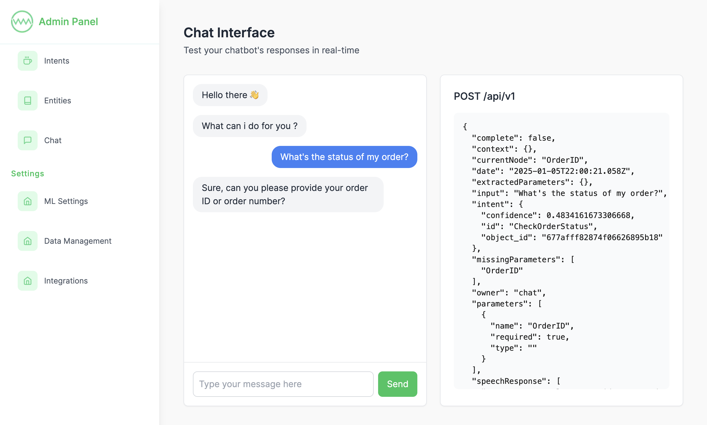

  

AI Chatbot Framework is an open-source, self-hosted, DIY Chatbot building platform built in Python. With this tool, it’s easy to create Natural Language conversational scenarios with no coding efforts whatsoever. 
The smooth UI makes it effortless to create and train conversations to the bot. AI Chatbot Framework can live on any channel of your choice (such as Messenger, Slack etc.).

You don’t need to be an expert at artificial intelligence to create an awesome chatbot that has AI capabilities. With this project you can create an AI powered chatbot in no time.  Read the [documentation](docs/README.md) to get started.

## Features
- Fully Self-Hosted
- Low-Code, DIY Admin Dashboard for Bot Development
- Multi-turn Conversations
- API request fulfilment (Tool Calling)
- Persistent Memory & Context Management
- Advanced Natural Language Understanding (NLU)
  - Spacy Word Embeddings
  - Intent Recognition (ML)
  - Entity Extraction (ML)
  - Zero shot NLU using Large Language Models (LLMs)
- Knowledge Base & FAQ answering using RAG (in development)
- Conversation Logs
- Channel Integrations
  - Web via REST API/Chat Snippet
  - Facebook Messenger
  - Slack (coming soon)
  - WhatsApp via Twilio (coming soon)

### Documentation

Check out our [documentation](docs/README.md) to get started.

### Tech Stack

 - Python / FastAPI / Pydantic
 - MongoDB / Motor
 - React / NextJS
 - scikit-learn / Tensorflow / Keras
 - Spacy / python-crfsuite
 - Docker / docker-compose / Kubernetes / Helm

### Contributing

Want to contribute? Check out our [contribution guidelines](CONTRIBUTING.md).

