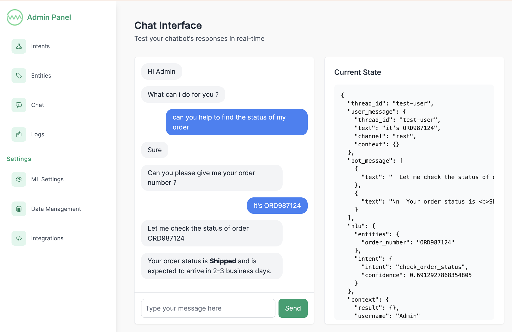

[](https://gitter.im/ai-chatbot-framework/Lobby?utm_source=badge&utm_medium=badge&utm_campaign=pr-badge&utm_content=badge) [](https://github.com/alfredfrancis/ai-chatbot-framework/actions/workflows/evaluate-backend.yml) [](https://github.com/alfredfrancis/ai-chatbot-framework/actions/workflows/evaluate-frontend.yml)


AI Chatbot Framework is an open-source, self-hosted, DIY Chatbot building platform built in Python. With this tool, it’s easy to create Natural Language conversational scenarios with no coding efforts whatsoever. 
The smooth UI makes it effortless to create and train conversations to the bot. AI Chatbot Framework can live on any channel of your choice (such as Messenger, Slack etc.).

You don’t need to be an expert at artificial intelligence to create an awesome chatbot that has AI capabilities. With this project you can create an AI powered chatbot in no time.  Read the [getting started guide](docs/01-getting-started.md) to get started.



## Features
- Fully Self Hosted
- Low Code, DIY, Admin Dashboard
- Multi-turn Conversations
- Advanced Natural Language Understanding (NLU)
  - Spacy Word Embeddings
  - Intent Recognition (ML)
  - Entity Extraction (ML)
  - One shot NLU using Large Language Models (LLMs)
- Persistent Memory & Context Management
- API request fulfilment
- Channel Integrations
  - Web using rest api/chat snippet
  - Facebook Messenger
  - Slack (coming soon)
  - WhatsApp via Twilio (coming soon)


## Index

* [Tech Stack](#tech-stack)
* [Installation](#installation)
  * [Docker Compose](#using-docker-compose)
  * [Helm](#using-helm)
* [Development](#development)
* [Tutorial](#tutorial)
* [Dependencies](#dependencies-documentations)

### Tech Stack

 - Python / FastAPI / Pydantic
 - MongoDB / Motor
 - React / NextJS
 - scikit-learn / Tensorflow / Keras
 - Spacy / python-crfsuite
 - Docker / docker-compose / Kubernetes / Helm

### Installation

### Using docker-compose (recommended)
```sh
docker-compose up -d
```

Open http://localhost:8080/

### Using Helm

```sh
helm dep update helm/ai-chatbot-framework

helm upgrade --install --create-namespace -n ai-chatbot-framework ai-chatbot-framework helm/ai-chatbot-framework

# port forward to local (optional)
kubectl port-forward --namespace=ai-chatbot-framework service/ingress-nginx-controller 8080:80
```

Open http://localhost:8080/

### Contributing

Want to contribute? Check out our [contribution guidelines](CONTRIBUTING.md).

### Tutorial

Check out our [tutorial](docs/01-getting-started.md) to get started.

<hr></hr>
