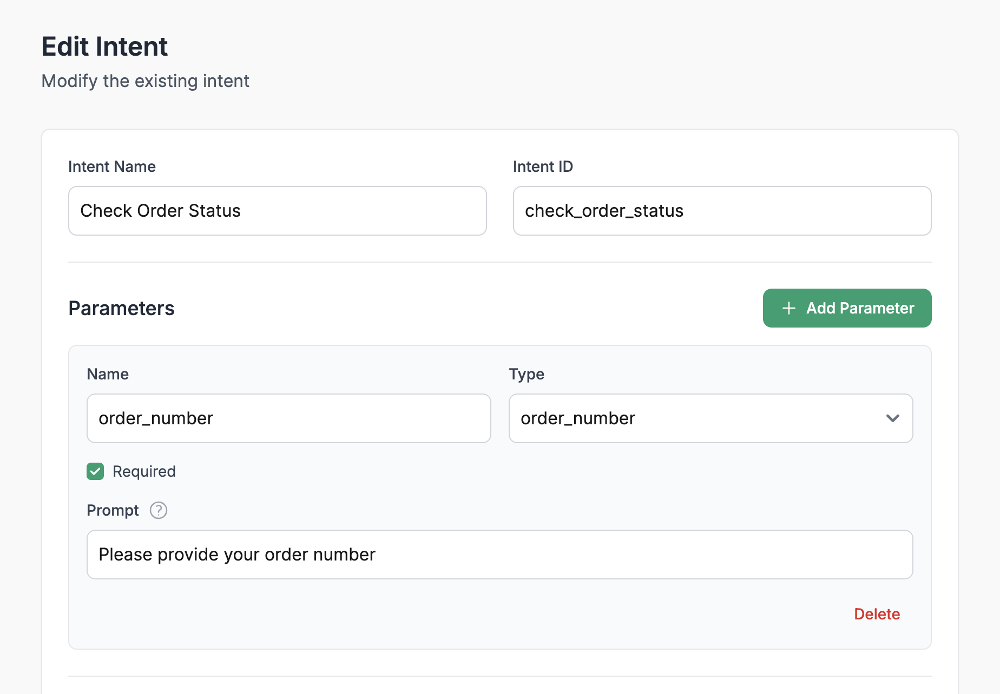
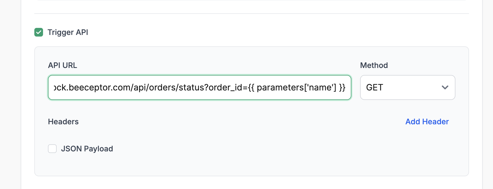
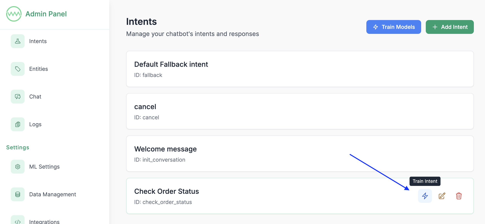
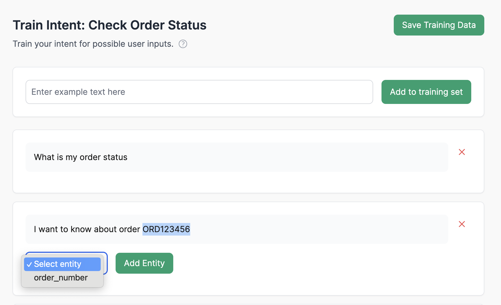
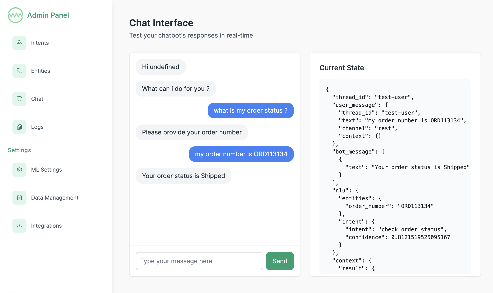

# Creating Order Status Check Bot

This guide walks you through creating a practical example of implementing order status check functionality in your chatbot.

For a quick start, you can find a pre-configured bot in the [examples folder](../examples/order_status.json). Import it through Settings/Data Management, then train the model via the "Train Models" button in the Intents page. Once done, you can proceed directly to the [testing](#testing) section.

## Configuration

### 1. Create Order Number Entity

1. Go to the Entities section
2. Create a new entity named "order_number"

### 2. Create the Intent

1. Navigate to the Intents section in the admin interface
2. Click "Create Intent"
3. Configure the basic intent information:
   - **Intent Name**: "Check Order Status"
   - **Intent ID**: "check_order_status"

#### Configure Parameters

Add the following parameter:
- **Name**: "order_number"
- **Type**: Select your order number entity type
- **Required**: Yes
- **Prompt**: "Please provide your order number"

[](screenshots/intent_configuration_1.png)

### 3. Set Up API Integration

We'll use a free dummy order status API for this example:

```
https://fake-store-api.mock.beeceptor.com/api/orders/status?order_id=ORD1234
```

Example API Response:
```json
{
  "order_id": 1,
  "user_id": 1,
  "status": "Shipped",
  "total_price": 849.97,
  "items": [ { "product_id": 1, "quantity": 2 }, { "product_id": 3, "quantity": 1 } ]
}
```

Configuration steps:
1. Enable "REST API Calling"
2. Add the API URL with parameter templating:
   ```
   https://fake-store-api.mock.beeceptor.com/api/orders/status?order_id={{ parameters['name'] }}
   ```
3. Choose method as GET
4. Leave the headers and JSON payload configurations as default

[](screenshots/intent_configuration_api_trigger.png)

### 4. Configure Response Template

In the response section of the intent, customize the response using the API result:
```
Your order status is {{ result['status'] }}
```

## Training
Now, let's train the NLU models to understand the user queries. We support two types of NLU pipelines:
   - Default NLU pipeline (using traditional ML and NLP algorithms, requires manual training)
   - Zero Shot NLU pipeline (using LLMs, no manual training needed)

For this example, we'll use the default NLU pipeline. 

### 1. Add Training Phrases

1. Go to Intents Page and click on the training icon
   [](screenshots/training_icon.png)

2. Add the following example phrases:
   - Tell me order status
   - What's the status of my order ORD123456?
   - Track order ORDER789012
   - Where is my order ORD123456?
   - Can you check order ORD789012 for me?
   - I want to know about order ORD123456
   - What is my order status

### 2. Label Entities

1. In each training phrase, highlight the order numbers
2. Select the "order_number" entity type
3. Ensure all variations are properly labeled

[](screenshots/training_entity_label.png)

### 3. Train the Model

1. Return to the Intents Page
2. Click "Train Models"
3. Wait for training completion
4. Test the intent with sample queries

## Testing

1. Navigate to the Chat Page
2. Test with different variations:
   - "What is my order status?"
   - "Track my order ORD123456"
   - "Where is ORDER789012?"
3. Verify the following:
   - Intent is correctly identified
   - Order number is properly extracted
   - API is triggered with correct parameters

[](screenshots/testing.png)

## Next Steps
- [Integrate with other channels](04-integrating-with-channels.md)