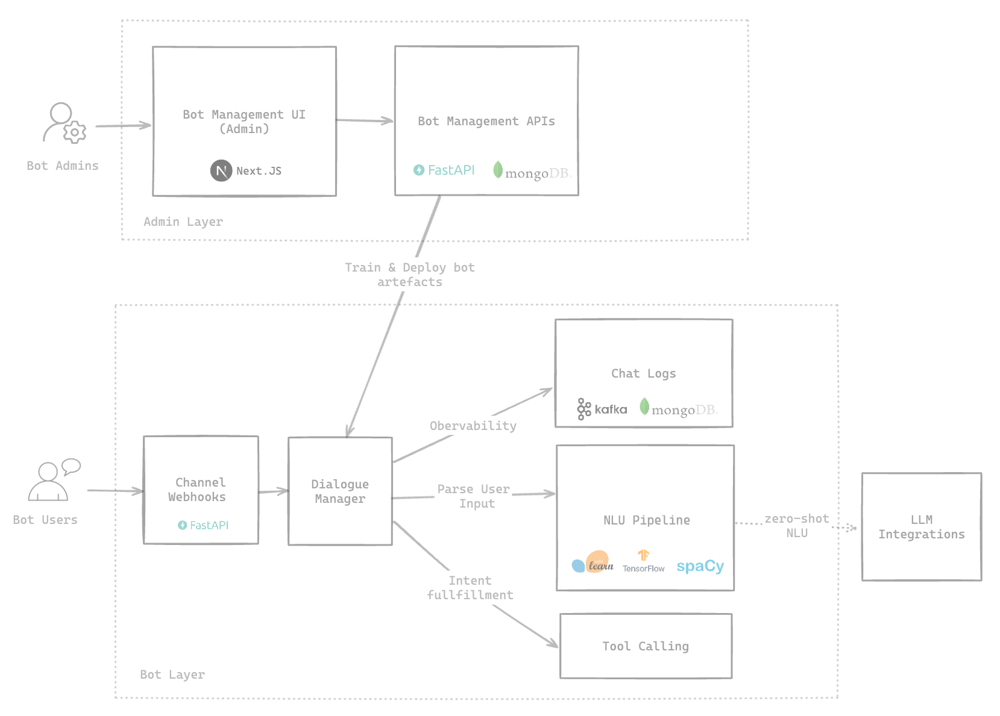

# Architecture Overview

This document provides a comprehensive overview of the AI Chatbot Framework's architecture, explaining its key components, interactions, and data flow.

## High Level Architecture

## Components 

### Dialogue Manager

The Dialogue Manager is the core component responsible for processing user messages and managing conversational state. 
It orchestrates the interaction between various components to understand user intent, extract parameters, maintain conversation context, and generate appropriate responses.

### NLU Pipeline

The NLU Pipeline is responsible for natural language understanding (NLU) tasks. 

### Memory Saver

The Memory Saver component is responsible for saving and retrieving conversation state.

### Channels

The Channels component is responsible for handling communication with different messaging channels (e.g., Facebook Messenger, Slack, REST API, etc.).